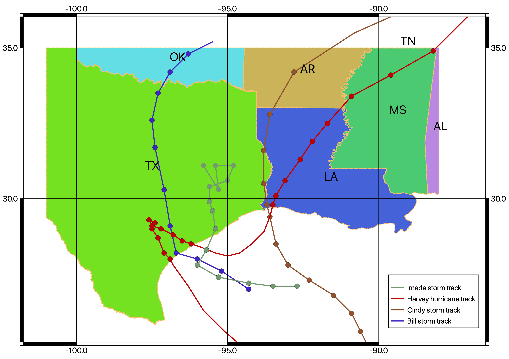

# TripleCollocation

This is the python implementation of Triple Collocation method.

## Introduction
The idea of using TC method in precipitation estimation is because under severe climate e.g. hurricane, turnado, None of the modern techniques of estimating rainfall (satellite, radar, gauge) can be recognized as ground truth. Thus, without leveraging any one of these, we actually propose a error model that take advantage of these three methods.

The big assumption of utilizing TC method is: 1) three data source must be independent. 2) The expectation of error due to three techniques is 0. 3)The errors for different products are independent.

The MTC method can be formularized as follow,

$$R_i=A_iT^{\beta_i}E_i$$

The following steps are rearanging these terms by calculating its corvariance, and coorelation coefficient.

## Objectives

1. Evaluate the applicability of TC method in extreme 

2. Inspect uncertainties of each product in measuring rainfall during extremes.

## Study domain

This is the map containing 9 states in the United States, which also subject to severe weather events the most. Besides, four events are selected to fall into this analysis. Hurricane Harvey (2017.08.25-2017.08.31), Tropical Cyclone Bill (2015.) Tropical Cyclone Cindy (2017. ) and Storm Imeda (2019)

## Datasets

three independent data are chosen: NCEP gridded hourly gauge only product, mrms radar only data, IMERG final PrecipitationUncal.

### NCEP vs. gauge raw data

spatial correlation map goes here...

## How to use

## Results

### NCEP + msmr + IMERG

The first combination is from NCEP gauge data, msmr radar data and IMERG satellite data. NCEP data are derived from raw data by reducing the covariance. msmr is the result calibrated by multiple radar network, and IMERG final run data without calibrated. So these three products are independent because they come from different sources. 

Image goes here...

### Kriging gauge+ msmr + IMERG
